<h2 style="text-align: center;">
    OUMOULAY Rashid 
    Systèmes Distribués 
    TP1_Partie1
</h2>

<strong>1. Créer l'interface IDao avec une méthode getData</strong>

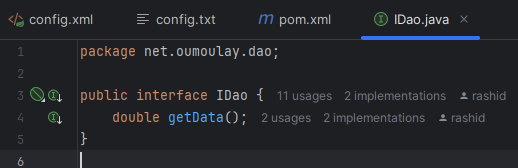  

<strong>2. Créer une implémentation de cette interface</strong>

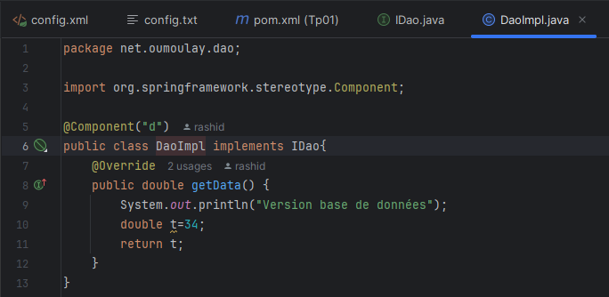  

<strong>3. Créer l'interface IMetier avec une méthode calcul</strong>

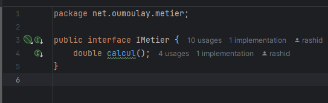  

<strong>4. Créer une implémentation de cette interface en utilisant le couplage faible</strong>

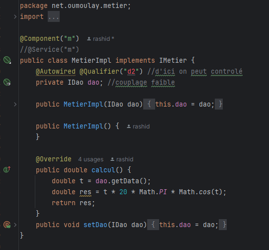  

<strong>5. Faire l'injection des dépendances :</strong>

<ul>
    <li>a. Par instanciation statique</li>
    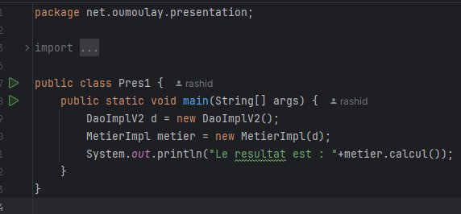 
    =>Resultat :
    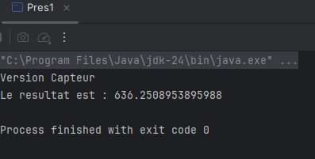  
    
    <li>b. Par instanciation dynamique</li>
    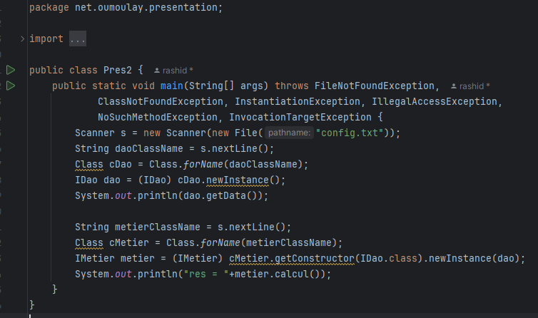 
    =>Resultat :
    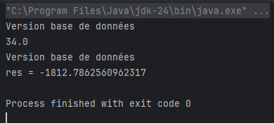  
    
    <li>c. En utilisant le Framework Spring
        - Version XML
        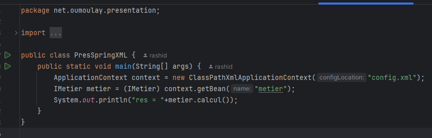 
        =>Resultat :
        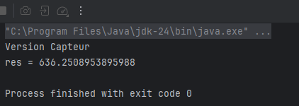  
        

        - Version annotations
        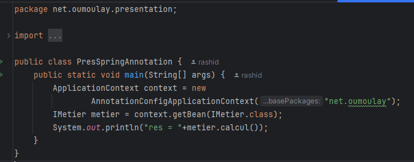 
        =>Resultat :
        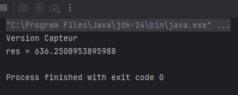  
    </li>
</ul>
